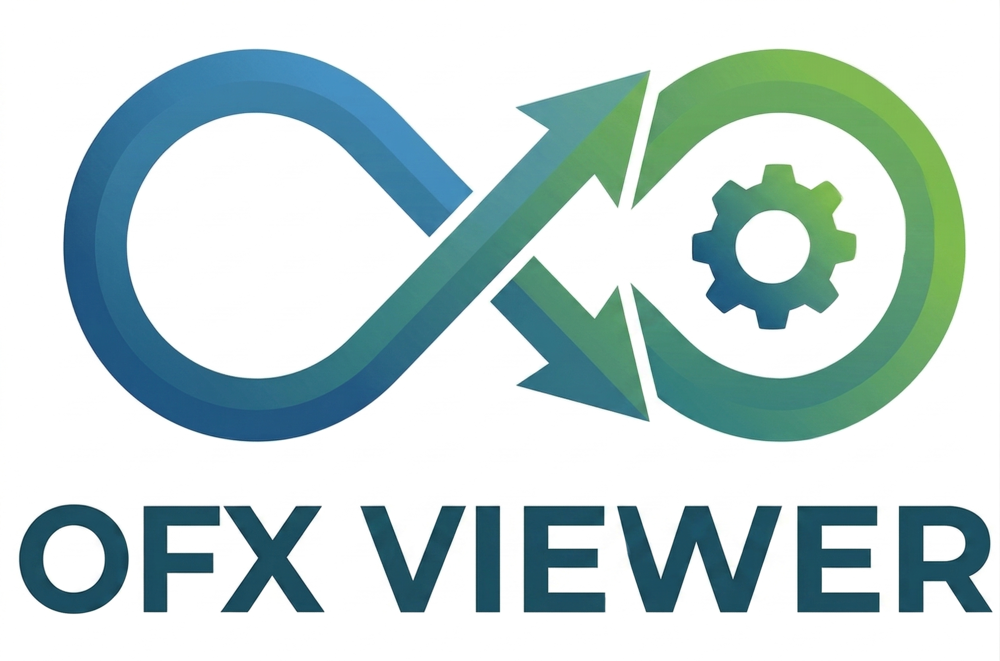
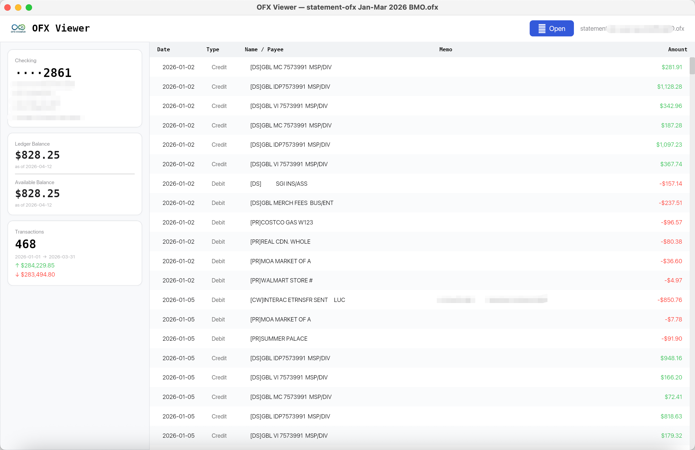

<p align="center">
  
</p>

<h1 align="center">OFX Viewer</h1>

<p align="center">
  A native desktop application for viewing <a href="https://en.wikipedia.org/wiki/Open_Financial_Exchange">Open Financial Exchange (OFX)</a> statement files.
  <br/>Built with <a href="https://iced.rs">Iced</a> and powered by <a href="https://github.com/Govcraft/ofx-rs">ofx-rs</a>.
</p>

---



## Features

- **Open any `.ofx` file** — supports both SGML (OFX 1.x) and XML (OFX 2.x) formats
- **Account overview sidebar** — account type, masked account ID, bank/branch IDs, currency, and OFX metadata
- **Ledger & available balances** — displayed with as-of dates
- **Transaction table** — sortable by date, type, name/payee, memo, and amount; credits in green, debits in red
- **Expandable transaction details** — click any row to reveal FIT ID, check number, SIC code, correction info, currency, and more
- **Multi-account support** — tab between accounts when the file contains more than one statement
- **Transaction statistics** — total count, date range, sum of credits and debits at a glance
- **Light, native UI** — fast startup, small binary, no Electron

## Getting Started

### Prerequisites

- **Rust 1.85+** (edition 2024)

### Build & Run

```bash
# Clone the repository (with the ofx-rs sibling)
git clone https://github.com/Govcraft/ofx-rs.git

# Build in release mode
cd ofx-viewer
cargo build --release

# Run
cargo run --release
```

The application window opens with an empty state. Click **Open** in the top-right corner and select an `.ofx` file.

## Project Structure

```
ofx-viewer/
├── src/
│   ├── main.rs              # Entry point – launches the Iced application
│   ├── app.rs               # Application state, update loop, and view composition
│   ├── application/         # File loading and OFX-to-domain mapping
│   ├── domain/              # AccountView and TxnRow data models
│   ├── infrastructure/      # Formatting helpers (decimals, dates)
│   └── presentation/        # UI views, messages, and theming
│       └── views/
│           ├── header.rs
│           ├── sidebar.rs
│           ├── transaction_table.rs
│           ├── transaction_detail.rs
│           └── empty_state.rs
├── res/                     # Logo and screenshot assets
└── Cargo.toml
```

## Dependencies

| Crate | Purpose |
|-------|---------|
| [iced](https://crates.io/crates/iced) | Cross-platform GUI framework |
| [ofx-rs](https://github.com/Govcraft/ofx-rs) | OFX document parser |
| [rfd](https://crates.io/crates/rfd) | Native file-open dialog |
| [rust_decimal](https://crates.io/crates/rust_decimal) | Precise decimal arithmetic |

## License

This project is available under the [MIT](../ofx-rs/LICENSE-MIT) / [Apache-2.0](../ofx-rs/LICENSE-APACHE) dual license.
